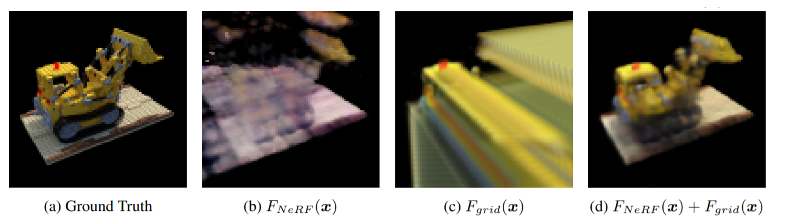
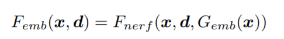
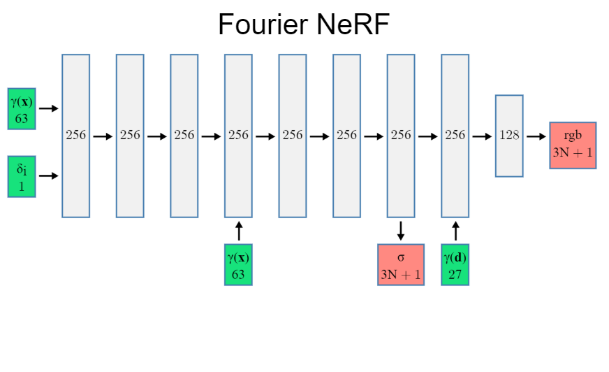

# Improving NeRF: Neural Radiance Fields
### Bilkent University
[CS 555](http://www.cs.bilkent.edu.tr/~sedat/CS484_555/index.html) - Introduction to Computer Vision Course Project

Spring 2021 

By Serkan Demirci

This project contains NeRF implementation (forked),
Experimented 3 methods  to improve the NeRF model.

Original NeRF project page: http://tancik.com/nerf


My implementation of three methods to improve NeRF.

## Methods Implemented

### Grid-NeRF Residual




### Grid Embeddings




### Fourier Nerf



## Setup

Python 3 dependencies:

* Tensorflow 2
* matplotlib
* numpy
* imageio
* configargparse
* Tensorflow Addons

## Running the code

After installing the dependencies, run the following to download the dataset,

```
bash download_example_data.sh
```

Full dataset can be found in: https://drive.google.com/drive/folders/128yBriW1IG_3NJ5Rp7APSTZsJqdJdfc1


Run,

```
python run_nerf.py --config project_configs/fern_nerf_config.txt
```

to train the default NeRF architecture. 

For the three methods described implemented in the project, change the --config argument with the following:

* project_configs/fern_grid_res_config.txt for Grid-NeRF residual method,
* project_configs/fern_embeddings_config.txt for Grid Embeddings method,
* project_configs/fern_fourier_config.txt for Fourier NeRF

You can use tensorboard to view the training progress,

```
tensorboard --logdir=logs/
```
